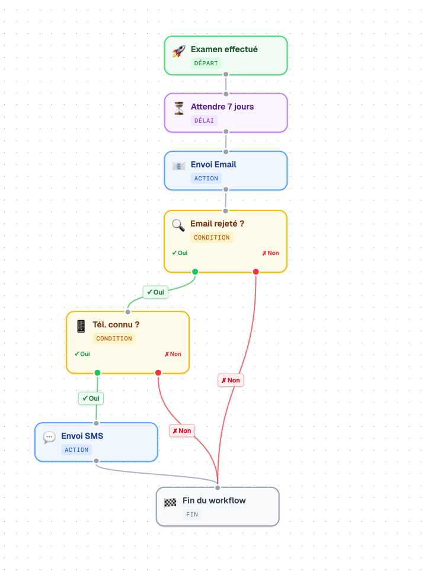
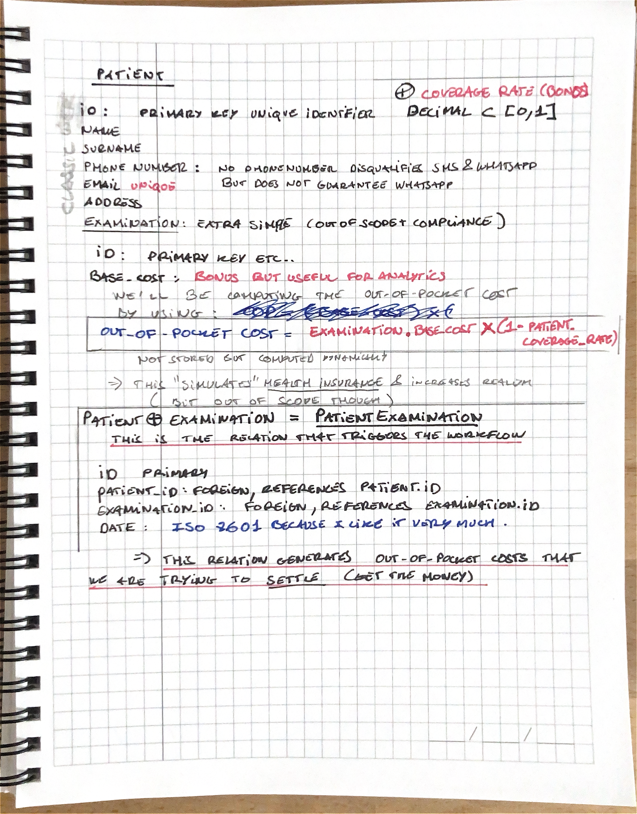
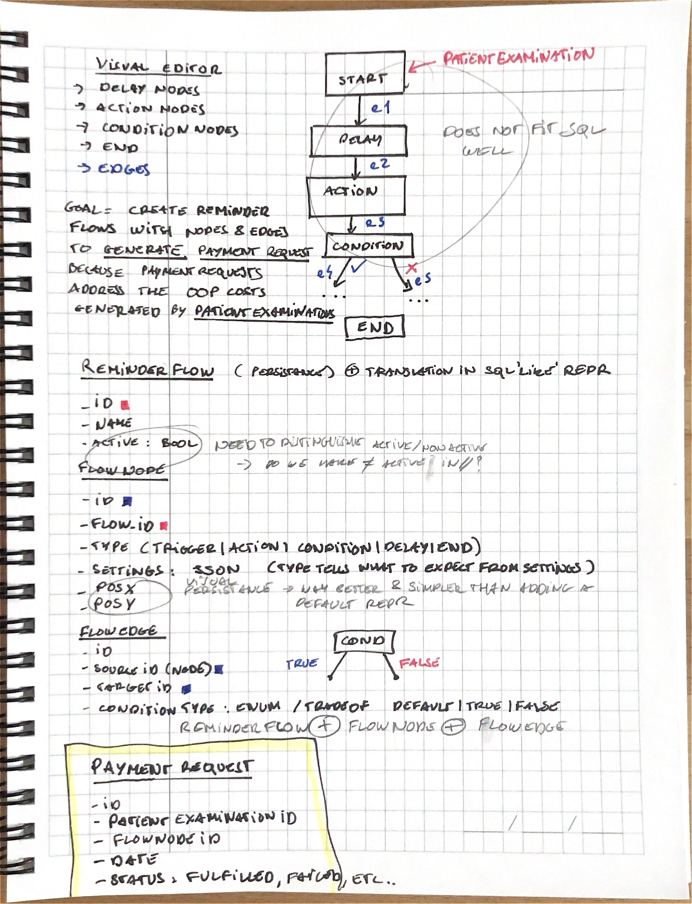

# SettleIT

Il s'agit de mon interprétation d'un des sujets proposés par la startup RainPath, une startup MedTech, dans le cadre de leur processus de recrutement.

**SettleIT** est une web-app permettant aux professionnels de santé d'éditer facilement des workflows visuels de relance, afin de recouvrer d'éventuels restes à charge patients, ou *out-of-pocket costs* en anglais.

L'objectif est donc, pour une base de patients donnée, de réduire l'encours total, c'est-à-dire la somme de tous les restes à charge impayés, via l'édition de schémas visuels de relance par différents canaux : email, SMS, courrier, etc.

SettleIT ne traite pas les paiements. L'application ne sert pas à encaisser directement de l'argent, mais à structurer, automatiser et suivre les relances qui peuvent mener au paiement.

L'éditeur de workflows de relance permet aussi de gérer l'absence de données côté patient en définissant des noeuds de condition et des fallbacks. Par exemple, si un patient n'a pas d'email renseigné, le workflow peut prévoir une relance par SMS, ou arrêter la branche concernée si aucune donnée exploitable n'est disponible.

<details>
<summary>Voir une illustration de workflow</summary>



</details>

## Pourquoi ce produit ?

Côté métier, pour des gestionnaires d'établissement de santé, les gains sont multiples. En voici une liste non exhaustive :

- **Clarté et processus de relance unifié :** l'édition de workflows permet d'avoir un process de relance clair, réplicable, et adaptatif selon les données patients disponibles.
- **Gain de temps :** les relances ne se font plus manuellement. Cela libère du temps aux équipes, qui peuvent adresser la variabilité des données patient via des noeuds de condition.
- **Optimisation des stratégies de relance :** éditer différents workflows et les mettre en production permettrait de tester différentes stratégies de relance, puis de comparer leur efficacité.
- **Visualisation instantanée des chiffres qui comptent :** encours total, montant recouvré, patients contactés, taux de succès des workflows, etc.

Si cela vous intéresse, je détaille ci-dessous mon approche pour ce projet.

## A) Les recherches

L'objectif de cette première étape était de gagner en contexte, en particulier sur les réglementations en vigueur concernant les relances dans le médical. Cela permet de tirer quelques règles métier simples et d'avoir un rendu final plus proche de la réalité.

Voici quelques apprentissages simples qui ont guidé mes choix :

- Les professionnels de santé sont en droit de demander au patient le paiement de tout acte médical effectivement réalisé, jusqu'à 2 ans après la réalisation de l'acte médical. On peut en extraire une règle simple : **un workflow en production ne s'appliquera pas aux patients dont la visite remonte à plus de 2 ans, mais on ne se privera pas de relancer un patient venu l'année dernière. On pourra mettre en application un workflow dès la création d'une visite patient en base.**
- Bien que floue, la législation en vigueur en France concernant les relances pour impayés interdit le harcèlement de la patientèle, sans forcément préciser directement la légalité de l'emploi de canaux multiples ni les délais exacts acceptables entre deux relances. **Pour rester prudent, on fixera donc un délai minimal de 7 jours entre deux relances, même en l'absence de noeud de temporisation explicite.**
- On peut aussi déceler une règle implicite de "niveaux" d'importance des moyens de communication employés : email < SMS < WhatsApp < courrier. Traduit en feature, cela pourrait donner lieu à des recommandations contextuelles lors de l'édition du graphe. Je précise que je n'ai pas implémenté cette feature complexe : faire un bon moteur de recommandations dynamique est un projet à part entière. On pourrait éventuellement l'imaginer avec un petit modèle spécialisé qui tournerait en parallèle, mais ce n'était pas le coeur du sujet ici.

Cette phase de recherche n'avait pas pour but de construire un produit juridiquement exhaustif. Elle m'a surtout servi à éviter de concevoir une app totalement hors-sol, et à transformer quelques contraintes réelles en règles produit simples.

## B) Stylo et papier : création des entités métier et des relations

Je suis personnellement convaincu que de bonnes entités et de bonnes relations, avec des tradeoffs raisonnables, permettent ensuite d'avancer beaucoup plus vite sur l'implémentation.

Pour moi, cette étape représente facilement 50% du travail.

<details>
<summary>Voir les schémas papier</summary>

Ces notes ont servi à poser les premières entités métier et leurs relations avant de construire le backend.

<p>
  
  
</p>

</details>

Les entités de base sont assez simples :

- `Patient`
- `Examination`
- `PatientExamination`

La relation `PatientExamination` sert de point de départ au workflow de relance.

L'idée métier est simple : une consultation ou un examen génère potentiellement un reste à charge pour le patient. Le job de SettleIT est ensuite de relancer le patient pour récupérer la somme due. Ces relances sont représentées par des `PaymentRequest`.

Pour générer ces `PaymentRequest`, l'application repose sur l'édition de workflows visuels, un peu à la manière d'un outil comme n8n. Un workflow est un graphe composé de noeuds et d'arêtes.

J'ai donc défini :

- `ReminderFlow`, qui permet de retrouver tous les composants d'un flow avec des jointures, et de distinguer les différents workflows.
- `FlowNode`, qui stocke les noeuds du graphe. Un noeud contient notamment un type, une position pour reconstruire le graphe visuellement, et un champ `settings` en JSON. Le type permet de savoir comment parser les settings, qui varient selon la nature du noeud.
- `FlowEdge`, qui représente le lien visuel entre deux noeuds. J'ai choisi d'en faire une entité dédiée par souci de propreté et de praticité. Un edge référence le noeud source et le noeud de destination, et possède également un type pour pouvoir afficher du texte ou interpréter le lien selon le contexte.
- `PaymentRequest`, qui est selon moi la table la plus importante. Elle référence la `PatientExamination`, le `FlowNode` exécuté, la date, et le résultat de la relance.

En résumé, `PaymentRequest` est ce que l'on cherche réellement à générer avec l'éditeur visuel. Le graphe est la configuration, les `PaymentRequest` sont les traces métier concrètes.

## C) Implémentation actuelle

Le projet est organisé en monorepo :

```text
SettleIT/
├── backend/
│   ├── prisma/
│   ├── src/
│   └── README.md
├── frontend/
│   ├── src/
│   └── README.md
├── assets/
└── README.md
```

Le backend est une API NestJS avec Prisma. Le frontend est une application React + TypeScript avec React Query. Le client API du frontend est généré depuis la documentation Swagger du backend, ce qui permet de garder les types alignés entre les deux parties.

À ce stade, le backend contient les modules CRUD, le schéma Prisma, les données de seed et la documentation Swagger. Le frontend contient la base technique, le client API généré, et peut être branché progressivement sur les écrans produit.

Les envois réels d'email, SMS, WhatsApp ou courrier ne sont pas branchés. C'est volontaire : SettleIT est ici concentré sur la modélisation, l'orchestration, la visualisation et le suivi des relances, pas sur l'intégration de prestataires d'envoi.

## Lancer le projet

### Backend

```bash
cd backend
npm install
npm run prisma:push
npm run prisma:seed
npm run start:dev
```

Le backend tourne sur :

```text
http://localhost:3000
```

La documentation Swagger est disponible ici :

```text
http://localhost:3000/api
```

### Frontend

Dans un second terminal :

```bash
cd frontend
npm install
npm run dev
```

Le frontend tourne sur :

```text
http://localhost:5173
```

Le frontend attend que le backend soit lancé sur `http://localhost:3000`.

## Générer le client API frontend

Si l'API backend change, il faut régénérer le client utilisé par le frontend :

```bash
cd frontend
npm run api:generate
```

Cette commande lit la documentation Swagger exposée par le backend et régénère les types TypeScript ainsi que les hooks React Query.

## Documentation par partie

- [README Backend](backend/README.md)
- [README Frontend](frontend/README.md)
